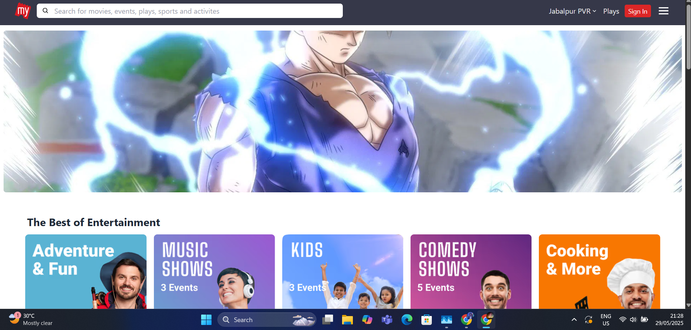

# Getting Started with Create React App
This project was bootstrapped with [Create React App]([https://github.com/facebook/create-react-app](https://bookmyshow-clone-omega.vercel.app/)).


### `npm start`
Runs the app in the development mode.\
Open [http://localhost:3000](http://localhost:3000) to view it in your browser.

--------------------------------------------------------------------------------------------------------------------------

## ScreenShots

# Home Page:


# Movie Page:


# Cats Page:


# @Book My show clone

react, 
tailwind,
react-slick (carousel),
react-icons,
react-context-api (State-Managemnt in React) /redux => heavy projects
axios 

## Key Features

### Home Page

- Dynamic landing page showcasing upcoming movies, events, and trending shows.
- Featured banners highlighting special promotions and offers.

### Movie Page

- Detailed information about a selected movie, including showtimes, cast, and reviews.
- Option to select seats and book tickets for a specific show.

### Event Page

- Information about upcoming events, concerts, and performances.
- Easy booking process for tickets to events.

### Order Page

- Seamless order process, allowing users to add tickets to their cart and complete the booking.

### Installation

To run the Project locally, follow these steps:

1. Clone the Repository

   ```bash
   git clone https://github.com/your-username/BookMyShow-clone.git
   ```

2. Navigate to the project directory

   ```bash
   cd BookMyShow-clone
   ```

3. Install the dependencies using npm

   ```bash
   npm install
   ```

## Usage

To start the development server and view the application, run the following command:

```bash
npm start
```

